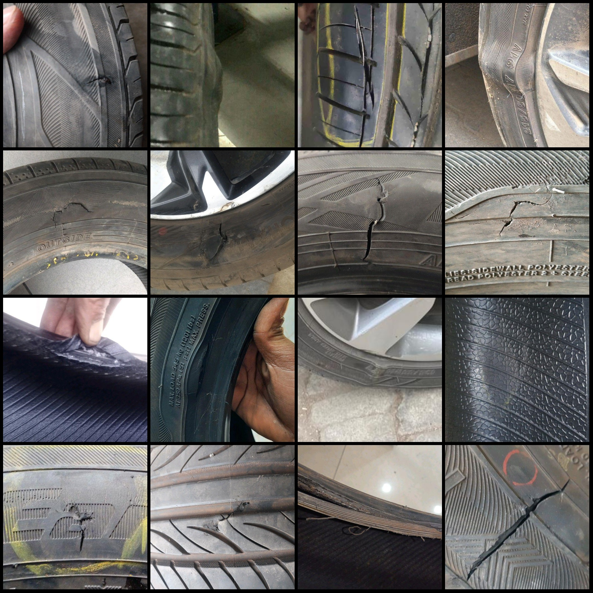
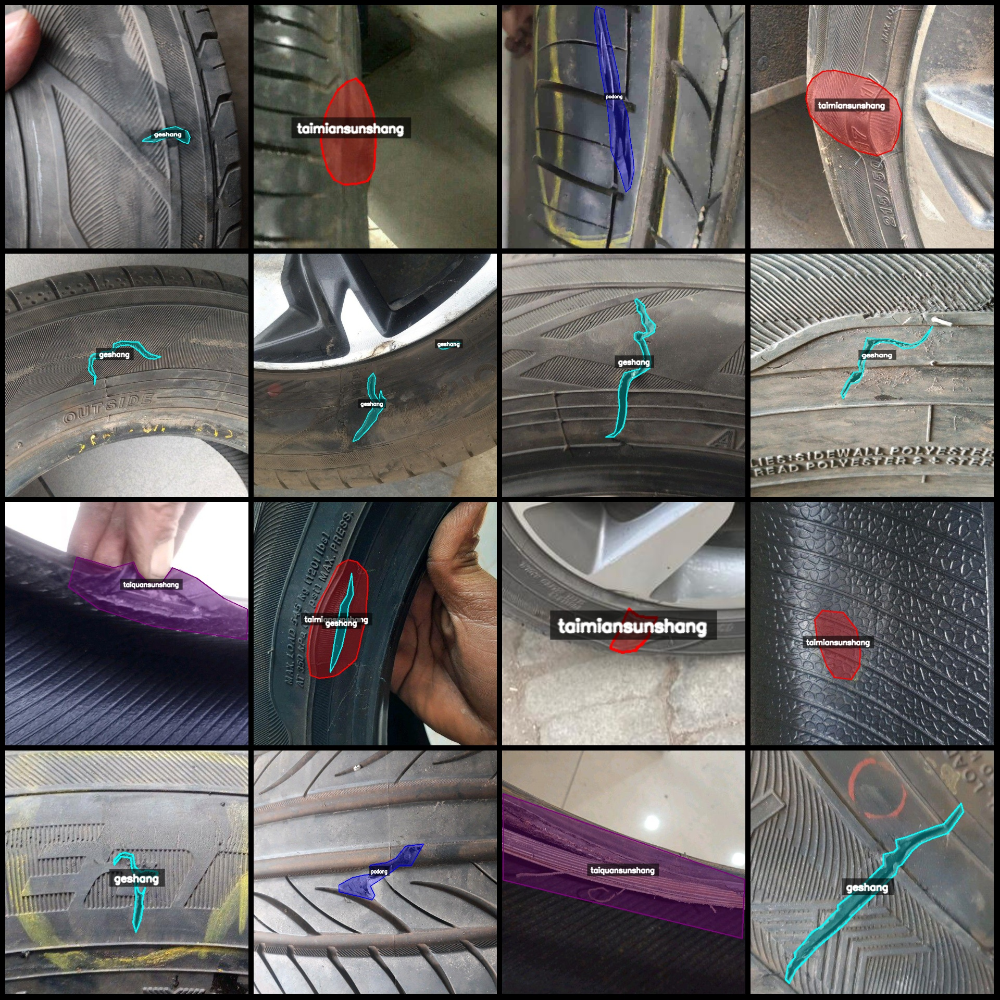
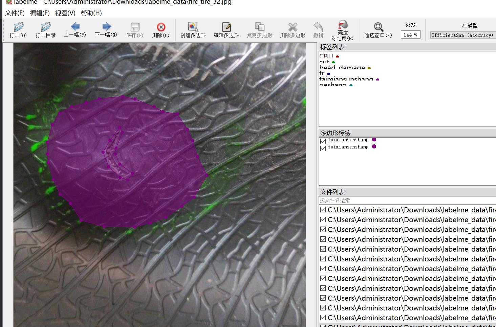

# Tire Surface Defect Identification and Segmentation Dataset (labelme format) - 879 Images with 4 Categories

Dataset Format: The dataset is in labelme format, without a mask file, only including JPG images and their corresponding JSON files.
Number of Images: 879 JPEG files
Number of Annotations: 879
Number of Classifications: 4
Classification Categories: ["Ge Shang", "Podong", "Taimian Sunshang", "Taiquan Sunshang"]
Number of Boxes for Each Classification:
- Ge Shang (Cut) count = 379
- Podong (Puncture) count = 188
- Taimian Sunshang (Tire Surface Damage) count = 289
- Taiquan Sunshang (Tire Ring Damage) count = 135
Total Boxes: 991

Labeling Tool Used: labelme=5.5.0
Image Resizing: Multiple resolution images, such as 370x528, 453x453, etc.
Annotation Rules: Polygons are drawn around the categories.
Important Notice: The dataset can be opened and edited using labelme, but the JSON dataset needs to be converted into either mask or yolo format or coco format for semantic segmentation or instance 
segmentation.
Special Disclaimer: This dataset does not guarantee the accuracy of the trained models or weight files.

Image Preview:

Annotation Example:
Original Images (randomly selected 16):
Annotation drawing result:
Labelme editing image example:

## Images

Here is a pay link on Stripe ( https://buy.stripe.com/3cs8yP7sY87d0vu9AB ). Please contact me lonlonago@foxmail.com after funding $89, and I will send you a complete data files , thank you!

